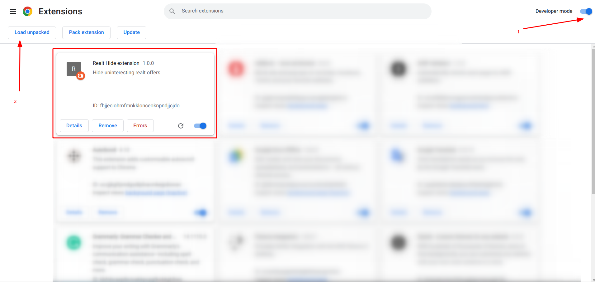
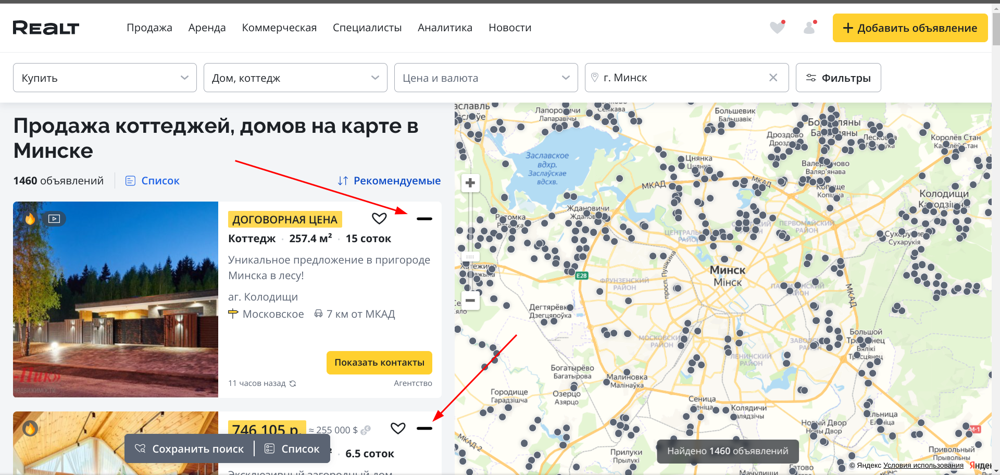

# Chrome Extension for Realt.by

Chrome extension for hiding unwanted ads on realt.by

# Clone
`git clone https://github.com/KudryavtsevSergey/realt_hide_extension.git`

`cd realt_hide_extension`

# Install deps and build
`npm install && npm run build`

# Add extension

### Enable dev mode in chrome

### Select path

### View result
Go to: `https://realt.by/sale/cottages/map/`

### View hidden

